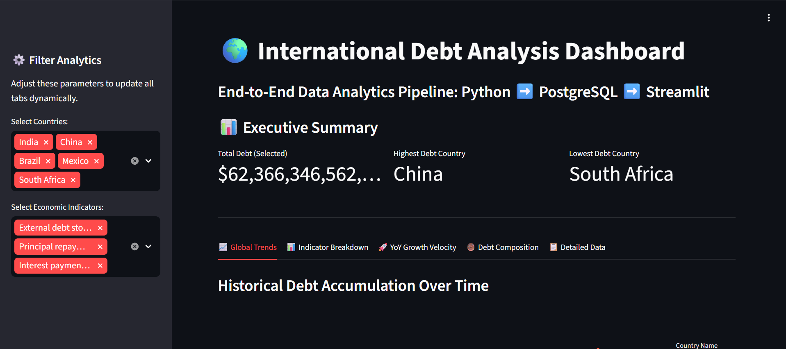

# 🌍 International-debt-analytics


## 📌 Project Overview
This project is an end-to-end data engineering and analytics pipeline built to process, analyze, and visualize World Bank global debt data. It transforms raw, wide-format CSV data into a fully relational PostgreSQL database and serves interactive financial insights through a dynamic Streamlit web dashboard.

## 🛠️ Tech Stack
* **Database:** PostgreSQL
* **Data Engineering:** Python, Pandas, SQLAlchemy
* **Data Visualization:** Streamlit, Plotly Express
* **Analysis:** Advanced SQL (Window functions, CTEs, Aggregations)

## 📂 Repository Structure
* `pipeline.py`: Ingests raw data, establishes the relational database structure, and enforces Primary/Foreign Key constraints.
* `reshape.py`: Cleans historical nulls and utilizes Pandas `.melt()` to convert the wide-format dataset into a clean, long-format structure.
* `international_debt_analysis.sql`: A master script containing 30 analytical queries (Basic, Intermediate, and Advanced) proving database manipulation skills.
* `debt_dashboard.py`: The frontend interactive web application featuring multi-tab visualizations (YoY velocity, Sunburst composition, and trend lines).
* `requirements.txt`: Contains all necessary Python libraries required to run the environment.
* `*.csv`: The raw World Bank dataset included for immediate, plug-and-play execution.

---

## 🚀 Setup & Installation

### 1. Clone the Repository
Download this code and the included dataset to your local machine:
```bash
git clone [https://github.com/your-username/your-repository-name.git](https://github.com/your-username/your-repository-name.git)
cd your-repository-name

`pip install -r requirements.txt`:LIbraries installation
`python pipeline.py`
`python reshape.py`
`streamlit run debt_dashboard.py`


